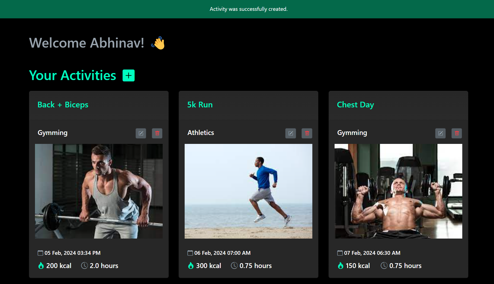

 # Web App Demonstration

 
[App Demo 1.webm](https://github.com/Abhinav158/activity-tracker/assets/93826081/9b1ea19d-1318-4ea0-88f5-1f1cae071a33)

# References 

1. Associations in Ruby -https://www.youtube.com/watch?v=rABIS4wmy0E

2. Active Storage for handling Image file uploads - https://guides.rubyonrails.org/active_storage_overview.html

